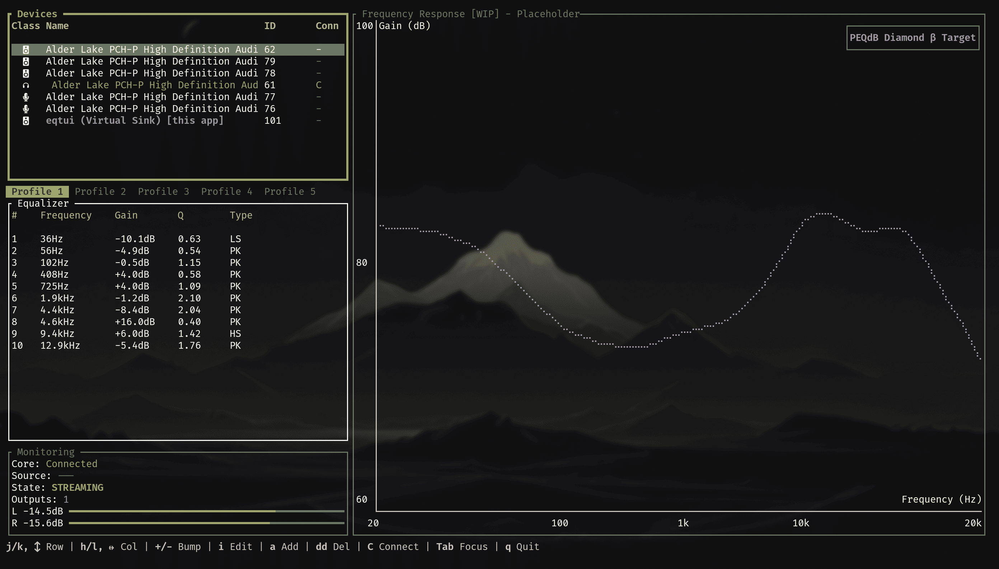

# eqtui

[](https://github.com/SiputBiru/eqtui/actions/workflows/ci.yml)
[](https://crates.io/crates/eqtui)
[](LICENSE)

A keyboard-driven parametric EQ for PipeWire that lives in the terminal.
Built with [Ratatui](https://ratatui.rs).



[EasyEffects](https://github.com/wwmm/easyeffects) is great, but sometimes I just
want a simple EQ — not a full DSP pipeline with a GTK or Qt UI.<br>
And also i just want to learn little bit about DSP stuff.

Runs as a background daemon so the EQ keeps going even after closing the TUI.

## Quick Start

```bash
cargo install eqtui --version 0.1.1-alpha.x # cause its still alpha 
# we still need to add specific version to make it working
eqtui daemon    # start the engine (background)
eqtui           # open the TUI
eqtui stop      # stop the daemon
eqtui restart   # restart the daemon
eqtui --help    # show all commands
eqtui --version # show version
```

Close with `q` — the EQ keeps running. Re-attach anytime with `eqtui attach`.

## Keybindings

`eqtui` uses Vim-inspired keybindings across several modes.

### Normal Mode (Navigation & Quick Actions)

| Key | Action |
| --- | --- |
| `q` | Quit TUI (Daemon stays running) |
| `Tab` | Switch focus between Devices and Pipeline (EQ) |
| `j` / `Down` | Move selection down |
| `k` / `Up` | Move selection up |
| `h` / `Left` | Move column selection left (Pipeline only) |
| `l` / `Right` | Move column selection right (Pipeline/Devices) |
| `i` | Enter **Insert Mode** to edit selected cell |
| `v` | Enter **Visual Mode** |
| `:` | Enter **Command Mode** |
| `a` | Add a new EQ band |
| `dd` | Delete selected EQ band |
| `gg` | Jump to the first EQ band |
| `r` | Reset selected band (Gain: 0, Q: 1) |
| `R` | Reset all bands in current profile |
| `+` / `=` | Increment selected cell value |
| `-` | Decrement selected cell value |
| `{` / `}` | Switch to previous/next profile |
| `b` | Toggle EQ Bypass |
| `c` / `C` | Toggle connection to selected device (Devices only) |

### Insert Mode (Cell Editing)

| Key | Action |
| --- | --- |
| `Enter` | Confirm changes and return to Normal Mode |
| `Esc` | Cancel changes and return to Normal Mode |
| `Backspace` | Delete character |
| `Any char` | Type into cell |

**Filter Types:** In the "Type" column, type `PK` (Peak), `LS` (LowShelf), or `HS` (HighShelf).

### Visual Mode (Bulk Operations)

| Key | Action |
| --- | --- |
| `j` / `Down` | Move selection down |
| `k` / `Up` | Move selection up |
| `d` | Delete selected EQ band and return to Normal Mode |
| `Esc` | Return to Normal Mode |

### Command Mode

| Command | Action |
| --- | --- |
| `:q` | Quit TUI |
| `:w` | Save current profile to `profiles.toml` |
| `:flat` | Set all gains in current profile to 0.0dB |
| `:load <path>` | Load a PEQ file (AutoEQ/Squiglink format) |
| `:bypass` | Toggle EQ Bypass |
| `:preamp <val>` | Set preamp gain (e.g., `:preamp -6.0`) |
| `:add [freq]` | Add a band at optional frequency (default 1000Hz) |
| `Esc` | Clear command and return to Normal Mode |

## Features (the short version)

- **Daemon/TUI split** — EQ engine stays alive when the UI closes
- **Parametric EQ** — frequency, gain, Q, filter type per band
- **AutoEQ import** — `:load` any PEQ file from AutoEQ / Squiglink
- **Profile system** — save/switch presets with `:w`
- **Vim-ish controls** — Normal/Insert/Visual/Command modes

## Config & Profiles

Settings are stored in standard `XDG` locations.

- **Config:** `~/.config/eqtui/config.toml`
- **Profiles:** `~/.config/eqtui/profiles.toml`
- **Logs:** `~/.local/share/eqtui/eqtui.log`

### Profile System

There are 5 profile slots available for saving different presets.

- **Saving & Applying:** Use `:w` to save the current EQ bands and preamp gain to the active slot. This also sends the settings to the audio engine.
- **Switching:** Use `{` and `}` to navigate between profiles.
- **Persistence:** The daemon loads these profiles automatically on startup.
- **External Files:** Profiles can be linked to external PEQ files. These profiles are **read-only** and display an `[RO]` indicator in the TUI.

#### Resetting Profiles

To reset EQ setings there is three ways:

- **Reset All Bands (`R`)**: Resets every band in the current profile (Gain: 0.0, Q: 1.0).
- **Reset Selected Band (`r`)**: Resets only the highlighted band (Gain: 0.0, Q: 1.0).
- **Flatten Gains (`:flat`)**: Sets all gains to 0.0dB but keeps your frequencies and Q values.

#### Normal vs Read-Only (`[RO]`)

| Feature | Normal Profile | `[RO]` Profile |
| :--- | :--- | :--- |
| **Reset in UI** | Yes | Yes (Temporary) |
| **Apply to Sound** | **Yes (`:w`)** | **No** (Locked to file) |
| **Save to Disk** | **Yes (`:w`)** | **No** (Locked to file) |

*Note: Changes made to `[RO]` profiles in the TUI are temporary and cannot be saved or applied to the DSP engine.*

### Profile File Format

The `profiles.toml` file contains an array of 5 profiles. A profile can either define its own `bands` or link to an external `path`.

**Example with external file:**

```toml
[[profiles]]
name = "AutoEQ Preset"
path = "@eqs/CVJVIVIANS1_Filters.txt"
```

**Example with inline data:**

```toml
[[profiles]]
name = "Custom Tune"
preamp = -6.0
[[profiles.bands]]
frequency = 100.0
gain = 3.5
q = 0.7
filter_type = "LowShelf"
```

**Fields:**

- `path`: (Optional) Portable path to an external PEQ file. Use `@` for paths relative to the config directory.
- `preamp`: Global gain offset in dB.
- `bands`: List of EQ filters (ignored if `path` is set).
  - `frequency`: Center frequency in Hz.
  - `gain`: Boost or cut in dB.
  - `q`: Quality factor (bandwidth).
  - `filter_type`: Either `"Peak"`, `"LowShelf"`, or `"HighShelf"`.

### Customizing Keys

You can change the default controls in your `config.toml`:

```toml
[keys.normal]
toggle_bypass = 'b'
add_band = 'a'
delete_band = 'd'

[keys.insert]
confirm = '\n'
cancel = '\x1b'
```

## Background Process Details

The daemon employs standard Linux mechanisms for lifecycle management and security:

- **XDG_RUNTIME_DIR:** The Unix socket and lock file are placed here to ensure they are isolated to the current user's session and automatically cleaned up on logout.
- **User Integrity:** The daemon only accepts connections from the same user ID that initiated the process.
- **Exclusive Advisory Locking:** An advisory lock (`flock`) on a dedicated file ensures only one daemon instance runs at a time. This method is robust against stale lock files from previous crashes.
- **Specialized POSIX Daemonization:** A custom double-fork procedure detaches the process from the controlling terminal. This prevents the daemon from unintentionally re-acquiring a terminal and ensures it continues running as a background service.
- **FD Security:** File descriptors for logs and the lock file are opened with `O_CLOEXEC` to prevent accidental inheritance by child processes (e.g., when spawning `pw-link`).

## Install from Source

```bash
git clone https://github.com/SiputBiru/eqtui
cd eqtui
cargo build --release
```

Needs PipeWire and a Nerd Font.

## Known Issues

- **Frequency Response Graph (Right Panel):** Still a work-in-progress.
  Currently renders a static placeholder target curve (PEQdB Diamond β, why PEQdb? idk man i just see it cool).
  The actual EQ transfer function overlay is not yet implemented.

---

[Project by SiputBiru](LICENSE) — patches welcome but no promises :^)
